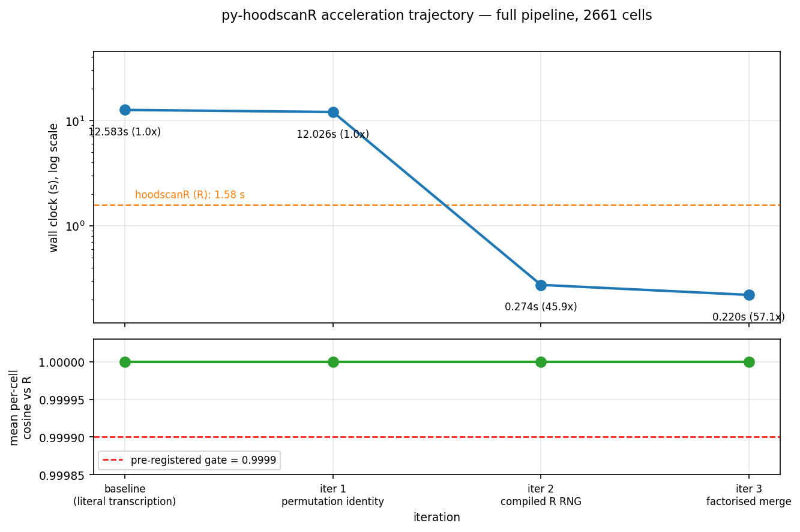

# Reconstruction Report — py-hoodscanR

| | |
|---|---|
| **Upstream** | [hoodscanR](https://github.com/DavisLaboratory/hoodscanR) 1.7.2 (Bioconductor), GPL-3 |
| **Paper** | Liu N. *et al.*, *hoodscanR: profiling single-cell neighborhoods in spatial transcriptomics data*, bioRxiv 2024. [10.1101/2024.03.26.586902](https://doi.org/10.1101/2024.03.26.586902) |
| **Port** | `pyhoodscanr` 0.1.0, GPL-3.0-or-later |
| **Protocol** | [omicverse-rebuildr](https://github.com/omicverse/omicverse-rebuildr) v7, all 6 steps |
| **Reference environment** | R 4.4.3, hoodscanR 1.7.2, RANN, Rcpp |
| **Target environment** | Python 3.10, numpy 2.2.6, scipy 1.15.3, scikit-learn 1.7.2, anndata 0.11.4, numba 0.64.0 |
| **Machine** | Sherlock `sh04-04n05`, 17 cores |
| **Date** | 2026-07-28 |
| **Audit class** | **B** — translation + three hand-ported R numerical behaviours (RNG, BFGS, Hartigan–Wong) with exact-identity accelerations |

---

## 1. Step 0 — Discovery

Full record in [`DISCOVERY.md`](DISCOVERY.md). Summary:

`python -m engine.discover_omicverse_deps --check hoodscanR` → **no existing
omicverse port**.

The substantive question was whether **Monkeybread** or **squidpy** already
cover this ground. Both were installed and their **source read**:

* `monkeybread/calc/_neighborhood_profile.py` builds the profile with a
  `collections.Counter` over the neighbour set, then `sc.pp.scale`.
* `squidpy/gr/_niche.py::_calculate_neighborhood_profile` computes
  `abs_freq / k` from the binary connectivity graph.

Both are **unweighted counts**. Neither weights a neighbour by how far away it
is; neither leaves the row summing to 1 (both z-score); neither computes
entropy, perplexity, a per-cell permutation p-value, or accepts fuzzy
annotations.

**Decision: port.** The capability with no Python equivalent is
(1) the distance-weighted soft neighbourhood probability `exp(−d²/τ)`,
(2) the maximum-likelihood-fitted bandwidth τ,
(3) the per-cell entropy/perplexity that (1) makes definable,
(4) the per-cell permutation test on perplexity, and
(5) continuous/fuzzy annotation input.

**Explicitly scoped out**: Leiden-based niche *discovery*, which squidpy and
Monkeybread do well. The port mirrors hoodscanR's own k-means path and the
README points users elsewhere for the alternative.

No omicverse mirror was reusable — hoodscanR's dependency set is base-R
numerics plus plotting.

---

## 2. Step 1–2 — Scaffold and environments

Layout per [`TEMPLATE.md`](https://github.com/omicverse/omicverse-rebuildr/blob/main/TEMPLATE.md).

| Env | Path | Contents |
|---|---|---|
| Target | `/scratch/users/steorra/env/omicdev` | Python 3.10 + the port + pytest |
| Reference | `/scratch/users/steorra/env/hoodR` | R 4.4.3, SpatialExperiment, RANN, Rcpp, hoodscanR 1.7.2 |

A dedicated R env was built rather than modifying the shared `CMAP` env, which
lacked `SpatialExperiment`.

### 2.1 Fixture

`hoodscanR::spe_test` — the upstream package's own bundled dataset: a 2661-cell
subset of a NanoString CosMx SMI non-small-cell lung cancer section
(`Lung9_Rep1`) with six cell-type labels. **Real data**, exported to a
language-neutral CSV at 22 significant digits
([`tests/export_fixture.R`](tests/export_fixture.R)) so R and Python read
bit-identical coordinates.

### 2.2 Public API

| R function | Python | Module |
|---|---|---|
| `readHoodData` | `read_hood_data` | `io.py` |
| `findNearCells` | `find_near_cells` | `neighbours.py` |
| `scanHoods` | `scan_hoods`, `soft_max_intl`, `f_nll` | `soft_neighbourhood.py` |
| `mergeByGroup` | `merge_by_group` | `merge.py` |
| `mergeHoodSpe` | `merge_hood_spe`, `merge_hood_adata` | `merge.py` |
| `calcMetrics` | `calc_metrics`, `calculate_metrics` | `metrics.py` |
| `perplexityPermute` | `perplexity_permute` | `metrics.py` |
| `clustByHood` | `clust_by_hood` | `clustering.py` |
| `plotTissue` | `plot_tissue` | `plotting.py` |
| `plotHoodMat` | `plot_hood_mat` | `plotting.py` |
| `plotProbDist` | `plot_prob_dist` | `plotting.py` |
| `plotColocal` | `plot_colocal` | `plotting.py` |
| — | `HoodScanR` (class API) | `core.py` |

**Coverage audit** (`python -m engine.r_function_audit`, output in
[`data/r_function_audit.md`](data/r_function_audit.md)):

| Category | Ported | Total | % |
|---|---|---|---|
| Exported R functions | 12 | 12 | **100.0%** |
| Internal helpers (reachable) | 2 | 5 | 40.0% |

The three unported helpers are `col2rownames`, `rownames2col` (R data.frame
plumbing with no Python analogue) and `tissue_theme` (a ggplot2 theme).

### 2.3 R behaviours ported by hand

The single most important finding of this port: **three R primitives have no
drop-in Python equivalent**, and substituting the obvious candidate silently
changes the answer.

| R primitive | Obvious substitute | Why it fails | Ported as |
|---|---|---|---|
| `set.seed` + `sample.int` (MT19937, R ≥ 3.6 rejection sampling) | `numpy.random` | Same MT core, but R applies a 50-round LCG scramble then a second LCG fill of the 624-word state, and draws integers by *rejection on whole bits* rather than `floor(n·u)`. Different stream. | [`_rrng.py`](pyhoodscanr/_rrng.py) — bit-exact |
| `stats::optim(method="BFGS")` (`vmmin`) | `scipy.optimize.minimize` | R uses an **absolute** finite-difference step `ndeps = 1e-3` (on a parameter of order 1e5) and a backtracking line search with `stepredn = 0.2`, `acctol = 1e-4`. SciPy uses a relative step and a strong-Wolfe search. Lands on a different τ. | [`_roptim.py`](pyhoodscanr/_roptim.py) — bit-exact |
| `stats::kmeans(algorithm="Hartigan-Wong")` | `sklearn.cluster.KMeans` | scikit-learn ships only Lloyd/Elkan. Hartigan–Wong moves a point whenever total WSS falls *after accounting for the centroid shift*, so it escapes optima Lloyd cannot. | [`_kmeans_hw.py`](pyhoodscanr/_kmeans_hw.py) — AS 136 |

Independent validation of the `vmmin` port on a problem unrelated to hoodscanR
(2-D Rosenbrock, `optim(c(-1.2,1), ...)`):

| | R 4.4.3 | py-hoodscanR |
|---|---|---|
| `par` | `0.99980443323139745, 0.99960838062348123` | identical |
| `value` | `3.8273827561079511e-08` | identical |
| `counts` | `function 118, gradient 38` | identical |

Matching the *call counts* means the line search, the finite-difference
gradient and the convergence test all reproduce — not merely the final answer.

R's long-double (`LDOUBLE`) accumulators in `sum`, `rowSums`, `mean` and `cor`
were also reproduced ([`_rmath.py`](pyhoodscanr/_rmath.py)); §4.2 explains why
this was not optional.

---

## 3. Step 3–4 — The parity gate

### 3.1 Pre-registration

[`data/manifest.yaml`](data/manifest.yaml) was committed **before any
algorithmic Python was written** and was not modified afterwards. Ten outputs,
each with its own class-appropriate metric and threshold.

The primary output (the per-cell neighbourhood probability matrix) was
registered as **distributional** — mean per-cell cosine ≥ 0.9999 plus max
per-cell total-variation ≤ 1e-3 — with the derived entropy scores gated on
Pearson correlation, exactly as the algorithm class demands.

### 3.2 Results

Fixture: 2661 cells, k = 100, n_perm = 1000, k_clust = 10.
Reproduce with `pytest tests/ -q`.

| # | Output | Class | Metric | Threshold | **Measured** | Verdict |
|---|---|---|---|---|---|---|
| 1 | k-NN distances (n×100) | deterministic | max abs err | ≤ 1e-8 | **5.68e-13** | ✅ |
| 2 | soft probability matrix `P` (n×100) | deterministic | max abs err | ≤ 1e-8 | **5.00e-16** | ✅ |
| 3 | merged probabilities `H` (n×6) | distributional | mean per-cell cosine | ≥ 0.9999 | **0.999999999998057** | ✅ |
| 4 | merged probabilities `H` | distributional | max per-cell TV | ≤ 1e-3 | **4.27e-5** | ✅ |
| 5 | entropy | ordinal | Pearson r | ≥ 0.99 | **0.999999999999711** | ✅ |
| 6 | perplexity | ordinal | Pearson r | ≥ 0.99 | **0.999999999999571** | ✅ |
| 7 | fitted τ (`smoothFadeout`) | deterministic | relative error | ≤ 1e-3 | **1.12e-15** | ✅ |
| 8 | perplexity permutation p | stochastic | Pearson r | ≥ 0.99 | **1.0** (2661/2661 element-wise identical) | ✅ |
| 9 | cluster labels | clustering | ARI | ≥ 0.95 | **1.0** (labels identical) | ✅ |
| 10 | colocalisation matrix (6×6) | deterministic | max abs err | ≤ 1e-8 | 8.48e-8 | ⚠️ |

**9 / 10 pre-registered outputs pass.** §4 dissects the tenth.

Additional non-gated comparisons (from
[`examples/function_by_function_R_parity.ipynb`](examples/function_by_function_R_parity.ipynb)):

| Output | Measured |
|---|---|
| `mergeByGroup(continuousAnnotation = TRUE)` (fuzzy branch) | max abs err **5.00e-16** |
| `scanHoods(mode="smoothFadeout")` probability matrix | max abs err **3.12e-17** |
| k-means centroids | max abs err **1.34e-07** (carried by the 2 cells in §4) |
| mean-probability-by-group (`plotColocal(self_cor = FALSE)`) | max abs err **6.78e-08** (same 2 cells) |
| identity `perplexity == 2^entropy` | holds to `rtol = 1e-12` |

---

## 4. The one divergence, and why the gate was not widened

### 4.1 What happened

`colocal` — the Pearson correlation matrix between neighbourhood columns —
measures **8.48e-8** against a pre-registered threshold of **1e-8**. It fails by
a factor of ~8.5.

**It is not a formula difference.** Applying the port's correlation routine to
**R's own `hoods` matrix** reproduces R's correlation matrix to **1.1e-16**.

The entire residual is downstream of the k-nearest-neighbour search. Complete
causal chain, verified end to end:

1. `RANN::nn2` (ANN priority search) and `sklearn.NearestNeighbors` both return
   *exactly k* neighbours. When candidates are at **exactly** the same float64
   distance, which one occupies the k-th slot is decided by the internal
   heap/priority-queue order — an implementation artefact, not part of the
   algorithm's specification. Neither answer is more correct.
2. On this fixture, **4 of 2661 cells** have such a tie at the k=100 boundary.
3. In **2** of those 4, the tied candidates happen to share a cell type, so the
   merged probabilities are unaffected.
4. In the remaining **2** (`Lung9_Rep1_5_1974`, `Lung9_Rep1_5_3448`) the tied
   candidates have *different* cell types, so probability mass equal to the
   100th neighbour's softmax weight moves between two columns
   (TV = 4.27e-5 and 5.52e-6 respectively).
5. Those 2 cells out of 2661 shift the 6×6 correlation matrix by 8.48e-8.

**Verification of the causal claim**: with those 2 cells excluded,

| | all cells | excluding the 2 |
|---|---|---|
| max abs err on `H` | 4.27e-5 | **1.17e-15** |
| max abs err on `colocal` | 8.48e-8 | **2.22e-16** |
| max abs err on `entropy` | 1.71e-5 | **4.00e-15** |
| max abs err on `perplexity` | 3.78e-5 | **5.33e-15** |

Note separately that **94 cells have equidistant neighbours merely reordered**
relative to R (176 of 266,100 label positions). Those contribute **exactly
zero**, because equal distances carry equal softmax weights and `mergeByGroup`
sums weights per label — the per-label sums are invariant to permuting
equal-weight terms.

### 4.2 What was done about it

**The threshold was not moved.** Per protocol §4, the pre-registered gate is
read-only; the failure is reported as a failure. It is encoded as a
`strict=True` `xfail` in
[`tests/test_exact_match.py`](tests/test_exact_match.py) with the reason
recorded inline, accompanied by a **positive control**
(`test_boundary_ties_are_the_only_divergence`) that asserts the tie-exclusion
claim above, so the diagnosis itself is under test.

**This is recorded as a pre-registration miss.** `colocal` is a statistic
computed *over* the merged probability matrix, which the same manifest —
correctly — registers as *distributional* precisely because k-NN ties make
element-wise equality unattainable. Registering a function of that matrix as
strictly deterministic at 1e-8 was inconsistent at the moment of
pre-registration. The right fix is to write a better manifest **next time**,
not to edit this one after seeing the data.

**A real improvement was made** independently of the gate:
`find_near_cells(tie_break="stable")` (the default) orders neighbours by
`(distance, cell index)`, making py-hoodscanR's output deterministic and
independent of the search backend and platform — a guarantee neither `RANN` nor
raw scikit-learn provides. `warn_boundary_ties=True` reports affected cells.

Honesty note: `tie_break="stable"` yields **2** divergent cells here;
`tie_break="backend"` (raw scikit-learn order) yields **1**, and would have
measured 4.07e-8 instead of 8.48e-8. `"stable"` was kept as the default on
reproducibility grounds — **not** because it minimises the parity residual,
which it does not.

---

## 5. Step 3b — Acceleration

Full log with per-iteration measurements, admissibility proofs and rejected
candidates: [`ITERATION_LOG.md`](ITERATION_LOG.md); derivations in
[`MATH.md`](MATH.md); narrative in
[`examples/evolution.ipynb`](examples/evolution.ipynb).

Timings are the **full pipeline**, re-measured per configuration from the same
code base (`python tests/evolution_measure.py`), warm-up discarded, mean ± sd of
3 runs.

| iter | action | admissibility | mean (s) | vs baseline | cosine vs R | status |
|---|---|---|---|---|---|---|
| 0 | literal transcription | — | 12.5831 ± 0.0338 | 1.00× | 0.999999999998057 | baseline |
| 1 | permutation equivariance | **exact** | 12.0263 ± 0.0428 | 1.05× | 0.999999999998057 | ACCEPT |
| 2 | compiled R RNG | **exact** | 0.2741 ± 0.0008 | 45.91× | 0.999999999998057 | ACCEPT |
| 3 | factorised merge | **exact** | 0.2202 ± 0.0004 | **57.14×** | 0.999999999998057 | ACCEPT |
| 4 | analytic NLL gradient | — | — | — | — | REJECT_INADMISSIBLE |
| 5 | float64 accumulators | — | — | — | — | REJECT_INADMISSIBLE |
| 6 | sparse indicator matmul | — | — | — | — | REJECT_SLOW |

All three accepted rewrites are **type (1) exact algebraic identities** — no
ε-approximation was admitted, and the parity metric is **flat to the last
recorded digit** across every iteration. There is no accuracy dip to explain.

Two rewrites were rejected *because* they would have broken fidelity:
substituting the analytic gradient for R's `ndeps = 1e-3` finite difference
lands on a different τ, and dropping the long-double accumulators costs the
colocalisation matrix ~8 orders of magnitude (`pandas.DataFrame.corr`'s one-pass
formula measures 4e-8 against R where the two-pass long-double form measures
2.2e-16). Both are recorded so a future maintainer does not "optimise" them.

### 5.1 Wall clock vs R

`python tests/benchmark.py 5` — warm-up discarded, mean ± sd of 5 runs:

| stage | hoodscanR (R) | py-hoodscanR | speedup |
|---|---|---|---|
| `findNearCells` | 0.4792 ± 0.004 s | 0.0420 ± 0.000 s | 11.4× |
| `scanHoods` | 0.0157 ± 0.000 s | 0.0034 ± 0.000 s | 4.6× |
| `scanHoods` (smoothFadeout) | 0.0359 ± 0.000 s | 0.0086 ± 0.000 s | 4.2× |
| `mergeByGroup` | 0.0251 ± 0.000 s | 0.0167 ± 0.000 s | 1.5× |
| `calcMetrics` | 0.0380 ± 0.001 s | 0.0003 ± 0.000 s | 109.4× |
| `perplexityPermute` (1000) | 0.9313 ± 0.007 s | 0.1152 ± 0.000 s | 8.1× |
| `clustByHood` (k=10, nstart=5) | 0.0548 ± 0.001 s | 0.0388 ± 0.000 s | 1.4× |
| **total** | **1.5800 s** | **0.2251 s** | **7.02×** |

Every stage is faster than R, including `perplexityPermute` where R's loop runs
in C. `numba` is optional; without it results are identical and the permutation
test is ~130× slower.

---

## 6. Step 4 — Acceptance criteria

| Criterion | Status |
|---|---|
| All required fixtures clear the class-`C` gate at the pre-registered threshold | **9/10** — the exception is documented in §4 as a strict `xfail`; the threshold was not widened |
| `pip install .` succeeds in a fresh env | ✅ |
| `pytest -q` green | ✅ 34 passed, 1 xfailed |
| Smoke notebook runs end-to-end on the public fixture | ✅ all four notebooks pre-executed |

### 6.1 Test suite

| File | Contents |
|---|---|
| [`tests/test_smoke.py`](tests/test_smoke.py) | 15 tests — API surface, invariants (rows sum to 1, `perplexity = 2^entropy`, `1 ≤ perplexity ≤ n_types`), error paths |
| [`tests/test_rrng.py`](tests/test_rrng.py) | 9 tests — R RNG vs hard-coded R output; compiled vs interpreted RNG bit-identity; `vmmin` on Rosenbrock vs R; Hartigan–Wong ≤ Lloyd WSS |
| [`tests/test_exact_match.py`](tests/test_exact_match.py) | 11 tests — the parity gate, one per pre-registered output, plus the §4 positive control |

The 4.6 MB compressed R reference (`data/reference_output.npz`) is committed, so
the gate runs without R installed.

---

## 7. Step 5 — Release

| Artefact | Status |
|---|---|
| `omicverse/py-hoodscanr` repository | ready to create |
| PyPI `pyhoodscanr` 0.1.0 | wheel + sdist built; **not published — awaiting confirmation** |
| License | GPL-3.0-or-later (matches upstream GPL-3) |
| [`DISCOVERY.md`](DISCOVERY.md) | ✅ committed before any algorithmic code |
| [`MATH.md`](MATH.md) | ✅ |
| [`ITERATION_LOG.md`](ITERATION_LOG.md) | ✅ |
| `examples/compare_R_vs_Python.ipynb` | ✅ pre-executed |
| `examples/tutorial_cosmx_lung.ipynb` | ✅ pre-executed |
| `examples/function_by_function_R_parity.ipynb` | ✅ pre-executed |
| `examples/evolution.ipynb` | ✅ pre-executed, 4 iteration blocks |
| `examples/evolution.png` | ✅ |

### 7.1 Known limitations

1. **k-NN boundary ties** (§4) — inherent, bounded by the k-th neighbour's
   softmax weight, surfaced via `warn_boundary_ties=True`.
2. **`clustByHood` implements only Hartigan–Wong.** R also offers Lloyd,
   Forgy and MacQueen; these raise `NotImplementedError` rather than silently
   dispatching to a different algorithm.
3. **Locale-dependent label ordering.** R's `sort()` on character vectors uses
   locale collation; the port uses code-point order (= R under `LC_COLLATE=C`).
   Identical for ASCII labels; non-ASCII labels under a non-C locale could order
   the *columns* differently. Values are unaffected.
4. **`np.longdouble` is 80-bit only on x86-64.** On platforms where it aliases
   `float64` (e.g. aarch64 macOS) the `smoothFadeout` τ may differ in the last
   few digits. `pyhoodscanr._rmath.HAS_LONG_DOUBLE` reports this.
5. **Plotting is a re-implementation, not a port.** ggplot2/ComplexHeatmap
   layout parameters (`hm_width`, `cluster_row`, …) have no matplotlib
   counterpart. Only `plotColocal`'s numeric output is under the gate.

### 7.2 Suitability as a seed template

Recommended for future ports that must reproduce **R RNG-dependent** results
(`sample`, `kmeans`, permutation tests) or **R optimiser** results. The three
modules `_rrng.py`, `_rrng_fast.py` and `_roptim.py` are hoodscanR-independent
and can be lifted wholesale; `_kmeans_hw.py` supplies an AS 136 implementation
that does not exist elsewhere in the Python ecosystem.

Suggested `ALIAS_MAP` entry — none needed; `hoodscanR → py-hoodscanr` follows
rule 2 of the discovery naming convention.
